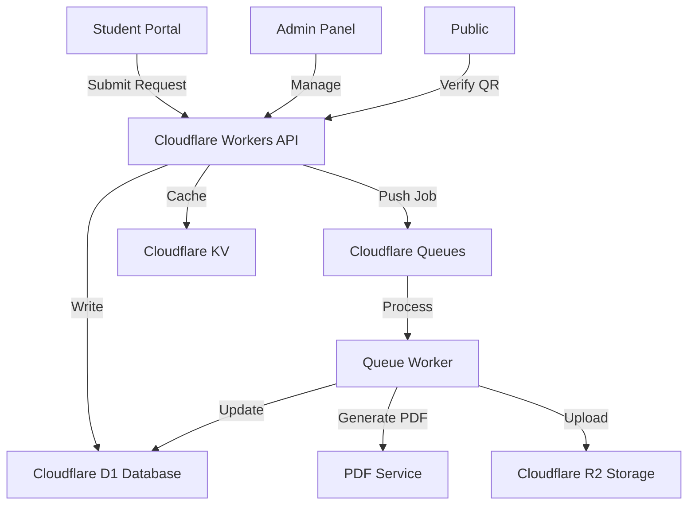

# Enhanced Architecture V2.0 - Enterprise SaaS Platform

## 🎯 Vision

Transform the TAT Certificate System into a **production-grade, enterprise-level, NO-CODE/LOW-CODE SaaS platform** for document automation.

### Core Philosophy
- ✅ **No hardcoding** - Everything dynamic and configurable
- ✅ **JSON-driven** - Templates, forms, and workflows
- ✅ **Async-first** - Queue-based processing for scalability
- ✅ **Admin-controlled** - Full CRUD for all entities
- ✅ **Future-proof** - Modular and extensible

---

## 📊 System Overview



---

## 🏗️ Architecture Layers

### Layer 1: Frontend (Vanilla JS/HTML/CSS)
- **Student Portal** - Card-based certificate selection, dynamic forms
- **Admin Panel** - Template manager, application manager, master data CRUD
- **Public Verification** - QR code verification page

### Layer 2: API Layer (Cloudflare Workers)
- **REST API** - All CRUD operations
- **Authentication** - Password + Google OAuth
- **Validation** - Zod schemas
- **Caching** - Cloudflare Cache API + KV

### Layer 3: Queue Layer (Cloudflare Queues)
- **Certificate Queue** - Async PDF generation
- **Notification Queue** - Email/WhatsApp (future)
- **Bulk Operations Queue** - Batch processing

### Layer 4: Data Layer (Cloudflare D1)
- **Master Data** - Branches, companies, templates, contacts
- **Applications** - Student requests with status tracking
- **Generated Certificates** - Metadata and versions
- **Audit Logs** - All actions tracked

### Layer 5: Storage Layer (Cloudflare R2)
- **PDF Storage** - Generated certificates
- **Assets** - Logos, signatures, watermarks
- **Backups** - Database exports

---

## 📦 Module Breakdown

### Module 1: JSON-Driven Template Engine

#### Template Structure
```json
{
  "id": "uuid",
  "name": "Internship Letter",
  "type": "internship",
  "version": 1,
  "active": true,
  "header_mode": "with_header",
  "qr_settings": {
    "enabled": true,
    "position": "bottom-right",
    "size": 100
  },
  "sections": {
    "header": {
      "enabled": true,
      "logo_url": "https://...",
      "title": "TRIDENT ACADEMY OF TECHNOLOGY"
    },
    "meta": {
      "ref_no": "TAT/{{branch_code}}/{{serial}}/{{year}}",
      "date": "{{issue_date}}"
    },
    "receiver": {
      "to": "{{company_hr_title}}",
      "company": "{{company_name}}",
      "address": "{{company_address}}"
    },
    "subject": {
      "text": "Application for {{cert_type}}"
    },
    "body": {
      "paragraphs": [
        "This is to certify that {{student_name}} (Reg. No: {{reg_no}}) is a bonafide student of {{branch_name}} department, pursuing {{session}} session.",
        "We request you to kindly provide {{him_her}} {{cert_type}} opportunity for a duration of {{duration}} starting from {{start_date}}."
      ],
      "conditions": [
        {
          "if": "{{cert_type}} == 'Internship'",
          "then": "This internship is part of the academic curriculum."
        }
      ]
    },
    "signature": {
      "name": "{{hod_name}}",
      "designation": "{{hod_designation}}",
      "email": "{{hod_email}}",
      "mobile": "{{hod_mobile}}"
    },
    "footer": {
      "enabled": true,
      "text": "This is a computer-generated document."
    }
  },
  "placeholders": [
    "student_name",
    "reg_no",
    "branch_name",
    "branch_code",
    "session",
    "cert_type",
    "company_name",
    "company_hr_title",
    "company_address",
    "duration",
    "start_date",
    "hod_name",
    "hod_designation",
    "hod_email",
    "hod_mobile",
    "serial",
    "year",
    "issue_date"
  ],
  "form_fields": [
    {
      "name": "student_name",
      "type": "text",
      "label": "Full Name",
      "required": true,
      "validation": "min:3,max:120"
    },
    {
      "name": "reg_no",
      "type": "text",
      "label": "Registration Number",
      "required": true
    },
    {
      "name": "branch",
      "type": "dropdown",
      "label": "Branch",
      "required": true,
      "source": "branches"
    },
    {
      "name": "company",
      "type": "dropdown_with_other",
      "label": "Company",
      "required": true,
      "source": "companies"
    },
    {
      "name": "duration",
      "type": "dropdown",
      "label": "Duration",
      "required": true,
      "source": "durations",
      "filter_by": "cert_type"
    },
    {
      "name": "start_date",
      "type": "date",
      "label": "Start Date",
      "required": true
    }
  ],
  "created_at": "2026-03-20T10:00:00Z",
  "updated_at": "2026-03-20T10:00:00Z",
  "created_by": "admin@tat.ac.in"
}
```

#### Features
- ✅ Sections: header, meta, receiver, subject, body, signature, footer
- ✅ Dynamic placeholders with {{variable}} syntax
- ✅ Conditional rendering (if/else logic)
- ✅ Header modes: with_header, without_header (letterhead support)
- ✅ QR settings: enable/disable, position, size
- ✅ Form fields auto-generated from template
- ✅ Template versioning
- ✅ Template cloning

#### CRUD Operations
- `POST /api/admin/templates` - Create template
- `GET /api/admin/templates` - List templates
- `GET /api/admin/templates/:id` - Get template
- `PUT /api/admin/templates/:id` - Update template
- `DELETE /api/admin/templates/:id` - Delete template
- `POST /api/admin/templates/:id/clone` - Clone template
- `POST /api/admin/templates/:id/preview` - Preview template

---

### Module 2: Dynamic Form Engine

#### Form Generation Logic
```typescript
function generateForm(template: Template): FormField[] {
  return template.form_fields.map(field => ({
    name: field.name,
    type: field.type,
    label: field.label,
    required: field.required,
    validation: parseValidation(field.validation),
    options: field.source ? fetchOptions(field.source) : null,
    conditional: field.conditional || null
  }));
}
```

#### Field Types
- `text` - Single-line text input
- `textarea` - Multi-line text input
- `dropdown` - Select from options
- `dropdown_with_other` - Select or enter custom
- `date` - Date picker
- `number` - Numeric input
- `email` - Email input
- `phone` - Phone number input

#### Validation Rules
- `required` - Field must not be empty
- `min:n` - Minimum length
- `max:n` - Maximum length
- `pattern:regex` - Regex validation
- `email` - Email format
- `phone` - Phone format
- `date` - Date format

#### Conditional Fields
```json
{
  "name": "internship_duration",
  "type": "dropdown",
  "label": "Duration",
  "conditional": {
    "show_if": "cert_type == 'Internship'"
  }
}
```

---

### Module 3: Async Queue-Based Architecture

#### Problem with Synchronous Processing
```
User clicks "Generate" → Worker generates PDF → Worker times out (10s limit)
                                              ↓
                                         User sees error ❌
```

#### Solution: Async Queue Processing
```
User clicks "Generate" → Worker validates → Push to Queue → Return "Processing"
                                                ↓
                                         Queue Worker processes
                                                ↓
                                         Generate PDF → Upload R2 → Update DB
                                                ↓
                                         Status: "Completed" ✅
```

#### Queue Implementation

**Producer (API Worker)**
```typescript
// POST /api/admin/certificates/generate
async function handleGenerate(request: Request, env: Env): Promise<Response> {
  const { application_id, template_id, issue_date } = await request.json();
  
  // Validate
  const application = await db.getApplication(application_id);
  if (!application) throw new Error('Application not found');
  if (application.status !== 'approved') throw new Error('Not approved');
  
  // Update status to processing
  await db.updateApplication(application_id, { status: 'processing' });
  
  // Push to queue
  await env.CERTIFICATE_QUEUE.send({
    application_id,
    template_id,
    issue_date: issue_date || new Date().toISOString().split('T')[0],
    timestamp: Date.now()
  });
  
  return jsonResponse({ status: 'processing', application_id });
}
```

**Consumer (Queue Worker)**
```typescript
// Queue Worker
export default {
  async queue(batch: MessageBatch<CertificateJob>, env: Env): Promise<void> {
    for (const message of batch.messages) {
      try {
        await processCertificate(message.body, env);
        message.ack();
      } catch (error) {
        console.error('Failed to process:', error);
        message.retry();
      }
    }
  }
};

async function processCertificate(job: CertificateJob, env: Env) {
  const { application_id, template_id, issue_date } = job;
  
  // 1. Fetch data
  const application = await db.getApplication(application_id);
  const template = await db.getTemplate(template_id);
  const branch = await db.getBranch(application.branch);
  
  // 2. Generate serial number (atomic)
  const serial = await db.getNextSerial(application.branch, new Date().getFullYear());
  const ref_no = `TAT/${branch.code}/${serial}/${new Date().getFullYear()}`;
  
  // 3. Render template
  const html = renderTemplate(template, {
    ...application,
    ...branch,
    ref_no,
    issue_date,
    serial,
    year: new Date().getFullYear()
  });
  
  // 4. Generate QR code
  const qr_url = `https://tat-certify.pages.dev/verify/${application_id}`;
  const qr_code = await generateQR(qr_url);
  
  // 5. Generate PDF
  const pdf = await generatePDF(html, qr_code, template.qr_settings);
  
  // 6. Upload to R2
  const pdf_key = `certificates/${ref_no}.pdf`;
  await env.R2_BUCKET.put(pdf_key, pdf);
  
  // 7. Update database
  await db.updateApplication(application_id, {
    status: 'completed',
    ref_no,
    pdf_url: `https://r2.tat-certify.com/${pdf_key}`,
    generated_at: new Date().toISOString()
  });
  
  // 8. Log certificate
  await db.logCertificate({
    ref_no,
    application_id,
    template_id,
    generated_on: issue_date,
    academic_year: getAcademicYear(issue_date)
  });
  
  // 9. Audit log
  await db.logAudit({
    action: 'certificate_generated',
    target_type: 'application',
    target_id: application_id,
    details: `Generated ${ref_no}`
  });
}
```

#### Status Flow
```
draft → submitted → approved → processing → completed
                                         ↓
                                      failed (with retry)
```

#### Frontend Polling
```javascript
async function pollStatus(application_id) {
  const interval = setInterval(async () => {
    const response = await fetch(`/api/applications/${application_id}`);
    const data = await response.json();
    
    if (data.status === 'completed') {
      clearInterval(interval);
      showSuccess('Certificate ready!');
      showDownloadButton(data.pdf_url);
    } else if (data.status === 'failed') {
      clearInterval(interval);
      showError('Generation failed. Please try again.');
    }
  }, 2000); // Poll every 2 seconds
}
```

---

### Module 4: Branch-Wise Contact Management

#### Data Model
```typescript
interface BranchContact {
  id: string;
  branch_id: string;
  contact_name: string;
  designation: string; // "HOD", "Coordinator", "Assistant"
  mobile_number: string;
  email: string | null;
  office_location: string | null;
  available_timing: string | null;
  active: boolean;
  priority: number; // 1 = primary, 2 = secondary
  created_at: string;
  updated_at: string;
}
```

#### Database Schema
```sql
CREATE TABLE branch_contacts (
  id TEXT PRIMARY KEY,
  branch_id TEXT NOT NULL,
  contact_name TEXT NOT NULL,
  designation TEXT NOT NULL,
  mobile_number TEXT NOT NULL,
  email TEXT,
  office_location TEXT,
  available_timing TEXT,
  active INTEGER NOT NULL DEFAULT 1,
  priority INTEGER NOT NULL DEFAULT 1,
  created_at TEXT NOT NULL,
  updated_at TEXT NOT NULL,
  FOREIGN KEY(branch_id) REFERENCES branches(code)
);

CREATE INDEX idx_branch_contacts_branch ON branch_contacts(branch_id);
CREATE INDEX idx_branch_contacts_active ON branch_contacts(active);
```

#### API Endpoints
- `POST /api/admin/branch-contacts` - Create contact
- `GET /api/admin/branch-contacts` - List all contacts
- `GET /api/admin/branch-contacts/:id` - Get contact
- `PUT /api/admin/branch-contacts/:id` - Update contact
- `DELETE /api/admin/branch-contacts/:id` - Delete contact
- `GET /api/branch-contacts/:branch_id` - Get contacts for branch (public)

#### Student UI Integration
```html
<!-- When status = "ready_for_signature" -->
<div class="contact-card">
  <h3>📋 Certificate Approved</h3>
  <p>Please contact the following person for signature and collection:</p>
  
  <div class="contact-details">
    <div class="contact-item">
      <span class="icon">👤</span>
      <span class="label">Name:</span>
      <span class="value">{{contact_name}} ({{designation}})</span>
    </div>
    <div class="contact-item">
      <span class="icon">📞</span>
      <span class="label">Mobile:</span>
      <a href="tel:{{mobile_number}}">{{mobile_number}}</a>
    </div>
    <div class="contact-item">
      <span class="icon">📧</span>
      <span class="label">Email:</span>
      <a href="mailto:{{email}}">{{email}}</a>
    </div>
    <div class="contact-item">
      <span class="icon">📍</span>
      <span class="label">Location:</span>
      <span class="value">{{office_location}}</span>
    </div>
    <div class="contact-item">
      <span class="icon">⏰</span>
      <span class="label">Timing:</span>
      <span class="value">{{available_timing}}</span>
    </div>
  </div>
  
  <div class="contact-actions">
    <button onclick="window.open('tel:{{mobile_number}}')">📞 Call Now</button>
    <button onclick="window.open('https://wa.me/{{mobile_number}}')">💬 WhatsApp</button>
  </div>
</div>
```

#### Template Integration
```json
{
  "workflow": {
    "requires_signature": true,
    "show_contact_details": true,
    "auto_generate": false
  }
}
```

---

### Module 5: PDF Generation with R2 Storage

#### PDF Generation Service
```typescript
async function generatePDF(
  html: string,
  qr_code: string | null,
  qr_settings: QRSettings
): Promise<ArrayBuffer> {
  // Option 1: Use external service (Puppeteer microservice)
  const response = await fetch('https://pdf-service.example.com/generate', {
    method: 'POST',
    headers: { 'Content-Type': 'application/json' },
    body: JSON.stringify({ html, qr_code, qr_settings })
  });
  
  return response.arrayBuffer();
  
  // Option 2: Use Cloudflare Browser Rendering API (future)
  // const browser = await puppeteer.launch();
  // const page = await browser.newPage();
  // await page.setContent(html);
  // const pdf = await page.pdf({ format: 'A4' });
  // await browser.close();
  // return pdf;
}
```

#### R2 Upload
```typescript
async function uploadToR2(
  env: Env,
  key: string,
  data: ArrayBuffer,
  metadata: Record<string, string>
): Promise<string> {
  await env.R2_BUCKET.put(key, data, {
    httpMetadata: {
      contentType: 'application/pdf'
    },
    customMetadata: metadata
  });
  
  return `https://r2.tat-certify.com/${key}`;
}
```

#### R2 Bucket Structure
```
certificates/
  ├── TAT-CSE-1-2026.pdf
  ├── TAT-CSE-2-2026.pdf
  ├── TAT-ECE-1-2026.pdf
  └── ...

assets/
  ├── logos/
  │   ├── tat-logo.png
  │   └── ...
  ├── signatures/
  │   ├── hod-cse.png
  │   └── ...
  └── watermarks/
      ├── draft.png
      └── superseded.png

backups/
  ├── 2026-03-20-db-backup.sql
  └── ...
```

---

### Module 6: QR Verification System

#### QR Code Generation
```typescript
import QRCode from 'qrcode';

async function generateQR(url: string): Promise<string> {
  return QRCode.toDataURL(url, {
    width: 200,
    margin: 1,
    color: {
      dark: '#000000',
      light: '#FFFFFF'
    }
  });
}
```

#### Verification Page
```html
<!-- /verify/:id -->
<div class="verification-page">
  <h1>🔍 Certificate Verification</h1>
  
  <div class="verification-result">
    <div class="status-badge valid">✅ Valid Certificate</div>
    
    <div class="certificate-details">
      <div class="detail-row">
        <span class="label">Reference No:</span>
        <span class="value">{{ref_no}}</span>
      </div>
      <div class="detail-row">
        <span class="label">Student Name:</span>
        <span class="value">{{student_name}}</span>
      </div>
      <div class="detail-row">
        <span class="label">Registration No:</span>
        <span class="value">{{reg_no}}</span>
      </div>
      <div class="detail-row">
        <span class="label">Branch:</span>
        <span class="value">{{branch_name}}</span>
      </div>
      <div class="detail-row">
        <span class="label">Certificate Type:</span>
        <span class="value">{{cert_type}}</span>
      </div>
      <div class="detail-row">
        <span class="label">Company:</span>
        <span class="value">{{company_name}}</span>
      </div>
      <div class="detail-row">
        <span class="label">Issue Date:</span>
        <span class="value">{{issue_date}}</span>
      </div>
      <div class="detail-row">
        <span class="label">Status:</span>
        <span class="value status-active">Active</span>
      </div>
    </div>
    
    <div class="verification-footer">
      <p>This certificate was issued by Trident Academy of Technology.</p>
      <p>Verified on: {{current_date}}</p>
    </div>
  </div>
</div>
```

#### API Endpoint
```typescript
// GET /api/verify/:id
async function handleVerify(id: string, env: Env): Promise<Response> {
  const certificate = await db.getCertificate(id);
  
  if (!certificate) {
    return jsonResponse({
      valid: false,
      message: 'Certificate not found'
    }, 404);
  }
  
  if (certificate.revoked) {
    return jsonResponse({
      valid: false,
      message: 'Certificate has been revoked',
      revoked_at: certificate.revoked_at,
      revoked_reason: certificate.revoked_reason
    }, 200);
  }
  
  return jsonResponse({
    valid: true,
    certificate: {
      ref_no: certificate.ref_no,
      student_name: certificate.student_name,
      reg_no: certificate.reg_no,
      branch_name: certificate.branch_name,
      cert_type: certificate.cert_type,
      company_name: certificate.company_name,
      issue_date: certificate.issue_date,
      status: 'active'
    }
  });
}
```

---

### Module 7: Versioning System

#### Version Tracking
```typescript
interface CertificateVersion {
  id: string;
  certificate_id: string;
  version: number;
  pdf_url: string;
  changes: string; // JSON string of changes
  edited_by: string;
  edit_reason: string;
  created_at: string;
  superseded: boolean;
}
```

#### Database Schema
```sql
CREATE TABLE certificate_versions (
  id TEXT PRIMARY KEY,
  certificate_id TEXT NOT NULL,
  version INTEGER NOT NULL,
  pdf_url TEXT NOT NULL,
  changes TEXT NOT NULL,
  edited_by TEXT NOT NULL,
  edit_reason TEXT,
  created_at TEXT NOT NULL,
  superseded INTEGER NOT NULL DEFAULT 0,
  FOREIGN KEY(certificate_id) REFERENCES certificate_log(ref_no)
);

CREATE INDEX idx_cert_versions_cert ON certificate_versions(certificate_id);
CREATE INDEX idx_cert_versions_version ON certificate_versions(version);
```

#### Version Creation Logic
```typescript
async function createNewVersion(
  certificate_id: string,
  changes: Record<string, any>,
  edited_by: string,
  reason: string,
  env: Env
): Promise<void> {
  // Get current version
  const current = await db.getCertificate(certificate_id);
  const next_version = current.version + 1;
  
  // Mark old PDF as superseded
  await db.updateCertificateVersion(current.id, { superseded: true });
  
  // Generate new PDF with watermark "Version 2"
  const html = renderTemplate(current.template, {
    ...current.data,
    ...changes,
    version: next_version
  });
  const pdf = await generatePDF(html, null, {});
  
  // Upload to R2
  const pdf_key = `certificates/${certificate_id}-v${next_version}.pdf`;
  await uploadToR2(env, pdf_key, pdf, {
    version: next_version.toString(),
    superseded: 'false'
  });
  
  // Save version
  await db.createCertificateVersion({
    id: generateUUID(),
    certificate_id,
    version: next_version,
    pdf_url: `https://r2.tat-certify.com/${pdf_key}`,
    changes: JSON.stringify(changes),
    edited_by,
    edit_reason: reason,
    created_at: new Date().toISOString(),
    superseded: false
  });
  
  // Update main certificate
  await db.updateCertificate(certificate_id, {
    version: next_version,
    pdf_url: `https://r2.tat-certify.com/${pdf_key}`,
    updated_at: new Date().toISOString()
  });
}
```

---

## 🗄️ Complete Database Schema

```sql
-- ============================================
-- MASTER DATA TABLES
-- ============================================

-- Branches (Departments)
CREATE TABLE branches (
  code TEXT PRIMARY KEY,
  name TEXT NOT NULL,
  prefix TEXT NOT NULL, -- For serial numbers (e.g., "CSE")
  hod_name TEXT NOT NULL,
  hod_designation TEXT NOT NULL DEFAULT 'HOD',
  hod_email TEXT NOT NULL,
  hod_mobile TEXT NOT NULL,
  current_serial INTEGER NOT NULL DEFAULT 0,
  serial_year INTEGER NOT NULL,
  active INTEGER NOT NULL DEFAULT 1,
  created_at TEXT NOT NULL,
  updated_at TEXT NOT NULL
);

-- Branch Contacts
CREATE TABLE branch_contacts (
  id TEXT PRIMARY KEY,
  branch_id TEXT NOT NULL,
  contact_name TEXT NOT NULL,
  designation TEXT NOT NULL,
  mobile_number TEXT NOT NULL,
  email TEXT,
  office_location TEXT,
  available_timing TEXT,
  active INTEGER NOT NULL DEFAULT 1,
  priority INTEGER NOT NULL DEFAULT 1,
  created_at TEXT NOT NULL,
  updated_at TEXT NOT NULL,
  FOREIGN KEY(branch_id) REFERENCES branches(code)
);

-- Companies
CREATE TABLE companies (
  id TEXT PRIMARY KEY,
  name TEXT NOT NULL UNIQUE,
  hr_title TEXT NOT NULL,
  address TEXT NOT NULL,
  verified INTEGER NOT NULL DEFAULT 0,
  created_at TEXT NOT NULL,
  updated_at TEXT NOT NULL
);

-- Academic Sessions
CREATE TABLE academic_sessions (
  value TEXT PRIMARY KEY,
  active INTEGER NOT NULL DEFAULT 1,
  created_at TEXT NOT NULL
);

-- Duration Policies
CREATE TABLE duration_policies (
  id TEXT PRIMARY KEY,
  cert_type TEXT NOT NULL CHECK (cert_type IN ('Internship', 'Apprenticeship')),
  label TEXT NOT NULL,
  active INTEGER NOT NULL DEFAULT 1,
  created_at TEXT NOT NULL
);

-- ============================================
-- TEMPLATE SYSTEM
-- ============================================

-- Templates (JSON-driven)
CREATE TABLE templates (
  id TEXT PRIMARY KEY,
  name TEXT NOT NULL,
  type TEXT NOT NULL CHECK (type IN ('Internship', 'Apprenticeship', 'Custom')),
  version INTEGER NOT NULL DEFAULT 1,
  template_json TEXT NOT NULL, -- Full JSON template
  active INTEGER NOT NULL DEFAULT 1,
  created_at TEXT NOT NULL,
  updated_at TEXT NOT NULL,
  created_by TEXT NOT NULL
);

-- Template Versions
CREATE TABLE template_versions (
  id TEXT PRIMARY KEY,
  template_id TEXT NOT NULL,
  version INTEGER NOT NULL,
  template_json TEXT NOT NULL,
  changes TEXT,
  created_at TEXT NOT NULL,
  created_by TEXT NOT NULL,
  FOREIGN KEY(template_id) REFERENCES templates(id)
);

-- ============================================
-- APPLICATION SYSTEM
-- ============================================

-- Applications (Student Requests)
CREATE TABLE applications (
  id TEXT PRIMARY KEY,
  template_id TEXT NOT NULL,
  student_name TEXT NOT NULL,
  reg_no TEXT NOT NULL,
  branch_id TEXT NOT NULL,
  form_data TEXT NOT NULL, -- JSON of all form fields
  status TEXT NOT NULL CHECK (status IN ('draft', 'submitted', 'approved', 'rejected', 'processing', 'completed', 'failed')),
  submitted_at TEXT,
  approved_at TEXT,
  approved_by TEXT,
  rejected_at TEXT,
  rejected_by TEXT,
  rejection_reason TEXT,
  created_at TEXT NOT NULL,
  updated_at TEXT NOT NULL,
  FOREIGN KEY(template_id) REFERENCES templates(id),
  FOREIGN KEY(branch_id) REFERENCES branches(code)
);

-- ============================================
-- CERTIFICATE SYSTEM
-- ============================================

-- Certificate Log
CREATE TABLE certificate_log (
  ref_no TEXT PRIMARY KEY,
  application_id TEXT NOT NULL,
  template_id TEXT NOT NULL,
  version INTEGER NOT NULL DEFAULT 1,
  pdf_url TEXT NOT NULL,
  generated_on TEXT NOT NULL,
  academic_year TEXT NOT NULL,
  revoked INTEGER NOT NULL DEFAULT 0,
  revoked_at TEXT,
  revoked_by TEXT,
  revoked_reason TEXT,
  created_at TEXT NOT NULL,
  FOREIGN KEY(application_id) REFERENCES applications(id),
  FOREIGN KEY(template_id) REFERENCES templates(id)
);

-- Certificate Versions
CREATE TABLE certificate_versions (
  id TEXT PRIMARY KEY,
  certificate_id TEXT NOT NULL,
  version INTEGER NOT NULL,
  pdf_url TEXT NOT NULL,
  changes TEXT NOT NULL,
  edited_by TEXT NOT NULL,
  edit_reason TEXT,
  created_at TEXT NOT NULL,
  superseded INTEGER NOT NULL DEFAULT 0,
  FOREIGN KEY(certificate_id) REFERENCES certificate_log(ref_no)
);

-- ============================================
-- SERIAL NUMBER SYSTEM
-- ============================================

-- Department Serials (Atomic counter)
CREATE TABLE department_serials (
  id TEXT PRIMARY KEY,
  branch_id TEXT NOT NULL,
  year INTEGER NOT NULL,
  current_serial INTEGER NOT NULL DEFAULT 0,
  updated_at TEXT NOT NULL,
  UNIQUE(branch_id, year),
  FOREIGN KEY(branch_id) REFERENCES branches(code)
);

-- ============================================
-- ADMIN & AUDIT
-- ============================================

-- Admin Users
CREATE TABLE admin_users (
  id TEXT PRIMARY KEY,
  email TEXT NOT NULL UNIQUE,
  auth_provider TEXT NOT NULL CHECK (auth_provider IN ('Password', 'Google')),
  role TEXT NOT NULL CHECK (role IN ('Admin', 'SuperAdmin')),
  status TEXT NOT NULL CHECK (status IN ('Pending', 'Approved')),
  google_sub TEXT UNIQUE,
  created_at TEXT NOT NULL,
  approved_at TEXT,
  approved_by TEXT,
  last_login_at TEXT
);

-- Audit Log
CREATE TABLE audit_log (
  id TEXT PRIMARY KEY,
  actor_email TEXT NOT NULL,
  actor_method TEXT NOT NULL,
  action TEXT NOT NULL,
  target_type TEXT NOT NULL,
  target_id TEXT NOT NULL,
  details TEXT,
  created_at TEXT NOT NULL
);

-- ============================================
-- SYSTEM STATE
-- ============================================

-- System State (Key-Value Store)
CREATE TABLE system_state (
  key TEXT PRIMARY KEY,
  value TEXT NOT NULL,
  updated_at TEXT NOT NULL
);

-- ============================================
-- INDEXES
-- ============================================

CREATE INDEX idx_applications_status ON applications(status);
CREATE INDEX idx_applications_branch ON applications(branch_id);
CREATE INDEX idx_applications_template ON applications(template_id);
CREATE INDEX idx_certificate_log_application ON certificate_log(application_id);
CREATE INDEX idx_cert_versions_cert ON certificate_versions(certificate_id);
CREATE INDEX idx_branch_contacts_branch ON branch_contacts(branch_id);
CREATE INDEX idx_audit_log_created ON audit_log(created_at);
CREATE INDEX idx_dept_serials_branch_year ON department_serials(branch_id, year);
```

---

## 🔌 API Endpoints

### Public Endpoints
- `GET /` - Landing page
- `GET /student` - Student portal
- `GET /verify/:id` - QR verification
- `GET /api/bootstrap/student` - Master data for student form
- `POST /api/applications` - Submit application

### Admin Endpoints (Authenticated)
- `POST /api/admin/login` - Admin login
- `POST /api/admin/google-login` - Google OAuth login
- `POST /api/admin/logout` - Logout
- `GET /api/bootstrap/admin` - All admin data

#### Template Management
- `POST /api/admin/templates` - Create template
- `GET /api/admin/templates` - List templates
- `GET /api/admin/templates/:id` - Get template
- `PUT /api/admin/templates/:id` - Update template
- `DELETE /api/admin/templates/:id` - Delete template
- `POST /api/admin/templates/:id/clone` - Clone template
- `POST /api/admin/templates/:id/preview` - Preview template

#### Application Management
- `GET /api/admin/applications` - List applications
- `GET /api/admin/applications/:id` - Get application
- `PUT /api/admin/applications/:id` - Update application
- `DELETE /api/admin/applications/:id` - Delete application
- `POST /api/admin/applications/:id/approve` - Approve application
- `POST /api/admin/applications/:id/reject` - Reject application

#### Certificate Generation
- `POST /api/admin/certificates/generate` - Generate certificate (push to queue)
- `GET /api/admin/certificates/:id/status` - Check generation status
- `POST /api/admin/certificates/:id/regenerate` - Regenerate certificate
- `POST /api/admin/certificates/:id/revoke` - Revoke certificate

#### Master Data Management
- `POST /api/admin/branches` - Create branch
- `GET /api/admin/branches` - List branches
- `PUT /api/admin/branches/:id` - Update branch
- `DELETE /api/admin/branches/:id` - Delete branch

- `POST /api/admin/branch-contacts` - Create contact
- `GET /api/admin/branch-contacts` - List contacts
- `PUT /api/admin/branch-contacts/:id` - Update contact
- `DELETE /api/admin/branch-contacts/:id` - Delete contact

- `POST /api/admin/companies` - Create company
- `GET /api/admin/companies` - List companies
- `PUT /api/admin/companies/:id` - Update company
- `DELETE /api/admin/companies/:id` - Delete company
- `POST /api/admin/companies/:id/verify` - Verify company

- `POST /api/admin/sessions` - Create session
- `GET /api/admin/sessions` - List sessions
- `DELETE /api/admin/sessions/:id` - Delete session

- `POST /api/admin/durations` - Create duration
- `GET /api/admin/durations` - List durations
- `PUT /api/admin/durations/:id` - Update duration
- `DELETE /api/admin/durations/:id` - Delete duration

#### Serial Management
- `GET /api/admin/serials` - List all serials
- `GET /api/admin/serials/:branch/:year` - Get serial for branch/year
- `PUT /api/admin/serials/:branch/:year` - Update serial
- `POST /api/admin/serials/:branch/:year/reset` - Reset serial

#### Audit & Logs
- `GET /api/admin/audit-log` - List audit logs
- `GET /api/admin/certificate-log` - List certificate log

---

## 🎨 Frontend Architecture

### Student Portal
```
/student
├── Certificate Selection (Cards)
├── Dynamic Form (Generated from template)
├── Form Validation
├── Company Dropdown (with "Other" option)
├── Submit Button
└── Status Tracking
```

### Admin Panel
```
/admin
├── Dashboard
│   ├── Statistics Cards
│   ├── Recent Applications
│   └── Quick Actions
├── Template Manager
│   ├── Template List
│   ├── Template Editor (JSON)
│   ├── Template Preview
│   └── Template Cloning
├── Application Manager
│   ├── Application List (with filters)
│   ├── Application Details
│   ├── Approve/Reject Actions
│   └── Generate Certificate
├── Master Data Manager
│   ├── Branches
│   ├── Branch Contacts
│   ├── Companies
│   ├── Sessions
│   └── Durations
├── Serial Control Panel
│   ├── Serial List
│   ├── Serial Reset
│   └── Serial Preview
├── Certificate Log
│   ├── Certificate List
│   ├── Certificate Details
│   ├── Version History
│   └── Revoke Certificate
└── Audit Log
    ├── Action List
    ├── Filters
    └── Export
```

---

## 🚀 Implementation Roadmap

### Phase 1: Foundation (Week 1-2)
- [ ] Update D1 schema with new tables
- [ ] Implement JSON template engine
- [ ] Create template CRUD API
- [ ] Build template editor UI
- [ ] Migrate existing templates to JSON format

### Phase 2: Dynamic Forms (Week 3)
- [ ] Implement form generation from template
- [ ] Add field validation
- [ ] Add conditional fields
- [ ] Update student portal UI
- [ ] Test form submission

### Phase 3: Async Queue System (Week 4)
- [ ] Set up Cloudflare Queues
- [ ] Implement queue producer (API)
- [ ] Implement queue consumer (Worker)
- [ ] Add status polling to frontend
- [ ] Test concurrent generation

### Phase 4: PDF & R2 (Week 5)
- [ ] Set up Cloudflare R2 bucket
- [ ] Implement PDF generation service
- [ ] Add QR code generation
- [ ] Upload PDFs to R2
- [ ] Update certificate log

### Phase 5: Branch Contacts (Week 6)
- [ ] Add branch_contacts table
- [ ] Implement contact CRUD API
- [ ] Build contact management UI
- [ ] Add contact display to student portal
- [ ] Test workflow integration

### Phase 6: Versioning (Week 7)
- [ ] Add certificate_versions table
- [ ] Implement version creation logic
- [ ] Build version history UI
- [ ] Add version comparison
- [ ] Test version restoration

### Phase 7: QR Verification (Week 8)
- [ ] Build verification page
- [ ] Implement verification API
- [ ] Add QR code to PDFs
- [ ] Test verification flow
- [ ] Add revocation feature

### Phase 8: Polish & Testing (Week 9-10)
- [ ] Add error handling
- [ ] Implement retry logic
- [ ] Add loading states
- [ ] Write tests
- [ ] Performance optimization
- [ ] Security audit
- [ ] Documentation

---

## 📊 Quota Impact Analysis

### Current System
- Requests: 705/day (0.7% quota)
- Rows read: 11,000/day (0.22% quota)
- Rows written: 700/day (0.7% quota)

### Enhanced System (with Queue)
- Requests: 500/day (0.5% quota) - Reduced due to async processing
- Rows read: 2,000/day (0.04% quota) - Reduced due to caching
- Rows written: 1,000/day (1% quota) - Increased due to versioning
- Queue messages: 100/day (0.01% of 1M/day limit)
- R2 storage: 100 MB/year (0.002% of 10 GB limit)

**Result: Still 100% FREE FOREVER** ✅

---

## 🎯 Success Criteria

### Functional Requirements
- ✅ Admin can create templates without code changes
- ✅ Forms auto-generate from templates
- ✅ Certificate generation is async and scalable
- ✅ PDFs stored in R2 with versioning
- ✅ QR verification works
- ✅ Branch contacts displayed correctly
- ✅ Full CRUD for all entities
- ✅ Audit trail for all actions

### Non-Functional Requirements
- ✅ Handles 1000+ concurrent users
- ✅ Never times out
- ✅ Never duplicates serial numbers
- ✅ Stays within free tier quotas
- ✅ Fast response times (<200ms)
- ✅ Mobile-responsive UI
- ✅ Accessible (WCAG 2.1 AA)

---

## 🔒 Security Considerations

### Authentication
- ✅ Password-based admin login
- ✅ Google OAuth with domain restriction
- ✅ Session-based authentication
- ✅ HMAC signature verification

### Authorization
- ✅ Role-based access control (Admin, SuperAdmin)
- ✅ Permission checks on all endpoints
- ✅ Audit logging for all actions

### Data Protection
- ✅ Input validation (Zod schemas)
- ✅ SQL injection prevention (parameterized queries)
- ✅ XSS prevention (sanitize HTML)
- ✅ CSRF protection (tokens)
- ✅ Rate limiting (per user, per endpoint)

### Certificate Security
- ✅ QR verification
- ✅ Revocation support
- ✅ Version tracking
- ✅ Watermarking for superseded versions

---

## 📝 Next Steps

1. **Review this architecture** - Validate all modules and features
2. **Prioritize features** - Decide which modules to implement first
3. **Create detailed specs** - Break down each module into tasks
4. **Start implementation** - Begin with Phase 1 (Foundation)

This architecture transforms the TAT Certificate System into a **world-class, enterprise-grade, NO-CODE SaaS platform** that can handle any document automation workflow without code changes.

**Ready to build the future of certificate management!** 🚀
