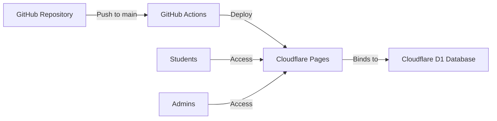
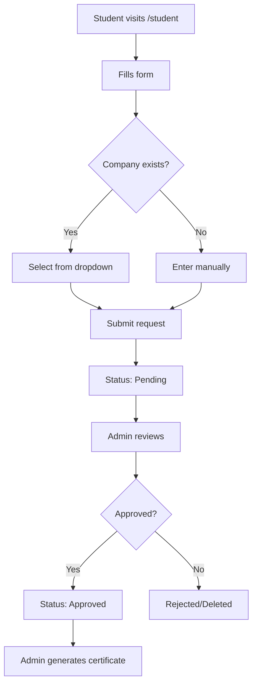
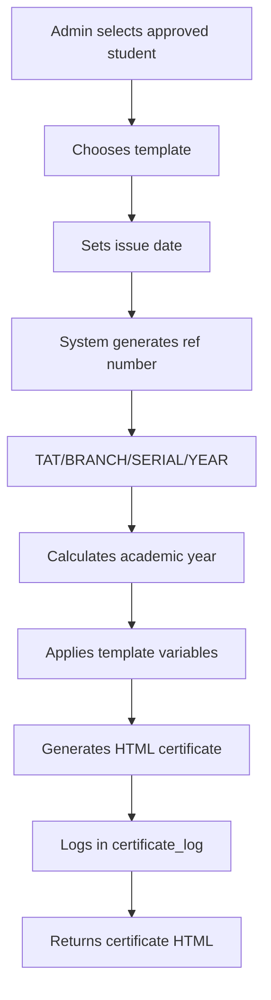
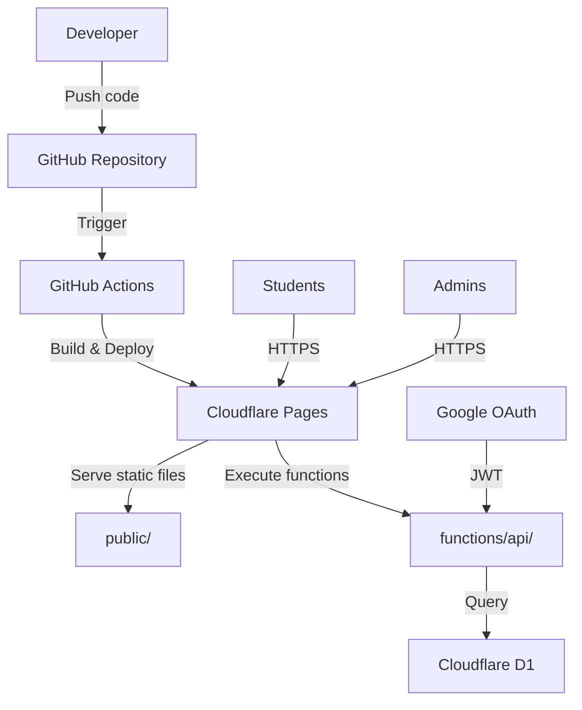

# TAT Certificate System - Project Analysis

## 📋 Project Overview

**TAT Certificate System** is a dynamic certificate request and generation system for **Trident Academy of Technology (TAT)**. It's designed for free deployment on GitHub + Cloudflare Pages + D1 database.

### Purpose
The system manages the complete lifecycle of internship and apprenticeship certificates:
- Students submit certificate requests
- Admins review and approve requests
- System generates professional certificates with unique reference numbers
- Certificates are designed for pre-printed TAT letterhead

---

## 🏗️ Architecture Overview

### Technology Stack
- **Backend**: Cloudflare Pages Functions (TypeScript)
- **Database**: Cloudflare D1 (SQLite-based)
- **Frontend**: Vanilla HTML, CSS, JavaScript
- **Validation**: Zod schema validation
- **Deployment**: GitHub Actions → Cloudflare Pages

### Deployment Model

---

## 📁 Project Structure

### Root Files
- [`package.json`](../package.json) - Dependencies and scripts
- [`tsconfig.json`](../tsconfig.json) - TypeScript configuration
- [`wrangler.toml`](../wrangler.toml) - Cloudflare configuration
- [`.dev.vars.example`](../.dev.vars.example) - Environment variables template
- [`README.md`](../README.md) - Documentation

### Source Code (`src/`)
- [`schema.ts`](../src/schema.ts) - Zod validation schemas and TypeScript types
- [`database.ts`](../src/database.ts) - Database initialization and seeding

#### Services (`src/services/`)
- [`certificateService.ts`](../src/services/certificateService.ts) - Core business logic (27KB)
- [`crud.ts`](../src/services/crud.ts) - Generic CRUD operations engine

#### Engines (`src/engines/`)
- [`reference.ts`](../src/engines/reference.ts) - Reference number generation (`TAT/{BRANCH}/{SERIAL}/{YEAR}`)
- [`academicYear.ts`](../src/engines/academicYear.ts) - Academic year calculation
- [`template.ts`](../src/engines/template.ts) - Template variable substitution

### API Layer (`functions/`)
- [`api/[[path]].ts`](../functions/api/[[path]].ts) - Main API router (20KB)
- [`types.d.ts`](../functions/types.d.ts) - Type definitions

### Frontend (`public/`)
- [`index.html`](../public/index.html) - Landing page
- [`student.html`](../public/student.html) - Student request form
- [`admin.html`](../public/admin.html) - Admin dashboard
- [`site.js`](../public/site.js) - Landing page scripts
- [`student.js`](../public/student.js) - Student form logic
- [`admin.js`](../public/admin.js) - Admin dashboard logic (27KB)
- [`styles.css`](../public/styles.css) - Global styles (21KB)
- [`_routes.json`](../public/_routes.json) - Cloudflare routing config

### Database (`migrations/`)
- [`0001_initial.sql`](../migrations/0001_initial.sql) - Initial schema
- [`0002_admin_auth_and_audit.sql`](../migrations/0002_admin_auth_and_audit.sql) - Admin auth and audit tables

---

## 🗄️ Database Schema

### Core Tables

#### `students`
Stores student certificate requests
- `id` (UUID) - Primary key
- `full_name`, `reg_no`, `branch`, `year`, `session`
- `cert_type` - "Internship" or "Apprenticeship"
- `company`, `company_hr_title`, `company_address`
- `duration`, `start_date`
- `status` - "Pending" or "Approved"
- `created_at`

#### `branches`
Department/branch master data
- `code` (Primary key) - Branch code (e.g., "CSE", "ECE")
- `name` - Full branch name
- `hod_name`, `hod_email`, `hod_mobile` - HOD details
- `current_serial` - Last used serial number
- `serial_year` - Year for serial tracking

#### `companies`
Approved company directory
- `name` (Primary key)
- `hr_title` - HR contact designation
- `address` - Company address

#### `academic_sessions`
Available academic sessions
- `value` (Primary key) - Format: "2023-2027"
- `active` - Boolean flag

#### `duration_policies`
Duration options for certificates
- `id` (UUID)
- `cert_type` - "Internship" or "Apprenticeship"
- `label` - Duration text (e.g., "6 weeks", "6 months")
- `active` - Boolean flag

#### `templates`
Certificate templates
- `id` (UUID)
- `name` - Template name
- `type` - "Internship" or "Apprenticeship"
- `content` - HTML template with `{{variable}}` placeholders
- `active` - Boolean flag

#### `certificate_log`
Generated certificate tracking
- `ref_no` (Primary key) - Format: `TAT/{BRANCH}/{SERIAL}/{YEAR}`
- `student_id` - Foreign key to students
- `template_id` - Foreign key to templates
- `generated_on` - Issue date
- `academic_year` - Academic year (e.g., "2024-25")

### Admin & Audit Tables

#### `admin_users`
Admin user management
- `id` (UUID)
- `email` - Admin email
- `auth_provider` - "Google"
- `status` - "Pending" or "Approved"
- `google_sub` - Google OAuth subject ID
- `created_at`, `approved_at`, `approved_by`, `last_login_at`

#### `audit_log`
Action tracking
- `id` (UUID)
- `actor_email`, `actor_method` - Who performed the action
- `action` - Action type (login, approve, reject, generate)
- `target_type`, `target_id` - What was affected
- `details` - Additional context
- `created_at`

#### `system_state`
System configuration key-value store
- `key` (Primary key)
- `value`
- `updated_at`

---

## 🔄 Core Workflows

### Student Request Flow

### Certificate Generation Flow

### Reference Number Engine
Format: `TAT/{BRANCH}/{SERIAL}/{YEAR}`

Example: `TAT/CSE/42/2024`

Logic:
1. Check if serial year matches current year
2. If not, reset serial to 0 and update year
3. Increment serial
4. Check if reference exists in certificate_log
5. If exists, increment and retry (up to 10,000 attempts)
6. Return unique reference number

### Academic Year Engine
Calculates academic year based on date:
- July-December → Current year to next year (e.g., 2024-25)
- January-June → Previous year to current year (e.g., 2023-24)

---

## 🔐 Authentication & Authorization

### Admin Authentication Methods

#### 1. Password-based (Local)
- Environment variables: `ADMIN_USERNAME`, `ADMIN_PASSWORD`, `ADMIN_SECRET`
- Session cookie: `tat_admin_session`
- Session contains: username, auth method, issued timestamp

#### 2. Google OAuth (Optional)
- Environment variable: `GOOGLE_CLIENT_ID`
- Restricted to domain: `GOOGLE_ALLOWED_HD` (default: `tat.ac.in`)
- JWT verification using Google's JWKS
- New Google users require approval by existing admin
- Status: "Pending" → "Approved"

### Session Management
- Cookie-based sessions
- HMAC-SHA256 signature verification
- Session payload: `{sub, username, authMethod, issuedAt}`

---

## 🎨 Frontend Architecture

### Pages

#### Landing Page ([`index.html`](../public/index.html))
- Hero section
- Feature highlights
- Navigation to student and admin portals

#### Student Portal ([`student.html`](../public/student.html))
- Dynamic form with validation
- Company dropdown (from approved companies)
- Manual company entry option
- Branch, session, duration dropdowns
- Form submission to `/api/students`

#### Admin Dashboard ([`admin.html`](../public/admin.html))
- Login (password or Google)
- Tabs:
  - **Requests** - Pending/approved student requests
  - **Branches** - Branch management
  - **Companies** - Company directory
  - **Sessions** - Academic sessions
  - **Durations** - Duration policies
  - **Templates** - Certificate templates
  - **Logs** - Certificate generation log
  - **Audit** - Admin action audit log
  - **Users** - Admin user management (Google auth)
- Certificate generation interface
- CRUD operations for all master data

### Styling
- Custom CSS with CSS variables
- Responsive design
- Print-optimized certificate layout
- A4 page dimensions (210mm × 297mm)
- Reserved space for pre-printed letterhead

---

## 🔧 API Endpoints

### Public Endpoints

#### `POST /api/students`
Submit student certificate request
- Body: Student form data
- Validation: Zod schema
- Returns: Created student record

#### `GET /api/bootstrap/student`
Get master data for student form
- Returns: branches, companies, sessions, durations

### Admin Endpoints (Require Authentication)

#### `POST /api/admin/login`
Password-based login
- Body: `{username, password}`
- Returns: Session cookie

#### `POST /api/admin/google-login`
Google OAuth login
- Body: `{credential, client_id, g_csrf_token}`
- Verifies JWT, checks domain
- Creates/updates admin user
- Returns: Session cookie or pending status

#### `POST /api/admin/logout`
Clear session cookie

#### `GET /api/bootstrap/admin`
Get all admin data
- Returns: students, branches, companies, sessions, durations, templates, certificate log, audit log, admin users

#### `POST /api/admin/students/:id/approve`
Approve student request
- Logs audit action

#### `DELETE /api/admin/students/:id`
Reject/delete student request
- Logs audit action

#### `POST /api/admin/certificates`
Generate certificate
- Body: `{studentId, templateId, issuedOn?}`
- Generates reference number
- Applies template
- Logs certificate generation
- Returns: HTML certificate

#### CRUD Endpoints
- `POST /api/admin/{resource}` - Create
- `GET /api/admin/{resource}` - List
- `PUT /api/admin/{resource}/:id` - Update
- `DELETE /api/admin/{resource}/:id` - Delete

Resources: branches, companies, sessions, durations, templates, admin-users

---

## 🎯 Key Features

### ✅ Implemented Features

1. **Student Request System**
   - Dynamic form with master data
   - Company selection or manual entry
   - Validation with Zod

2. **Admin Approval Workflow**
   - Review pending requests
   - Approve/reject actions
   - Audit logging

3. **Certificate Generation**
   - Template-driven HTML generation
   - Unique reference numbers
   - Backdated certificate support
   - Academic year calculation

4. **Master Data Management**
   - Branches with HOD details
   - Company directory
   - Academic sessions
   - Duration policies
   - Certificate templates

5. **Authentication**
   - Password-based admin login
   - Google OAuth with domain restriction
   - Admin approval workflow for new Google users

6. **Audit System**
   - Login tracking
   - Approval/rejection logging
   - Certificate generation logging

7. **Reference Number Engine**
   - Format: `TAT/{BRANCH}/{SERIAL}/{YEAR}`
   - Auto-increment with year reset
   - Collision detection

8. **Template System**
   - HTML templates with variable substitution
   - Multiple templates per certificate type
   - Active/inactive flag

---

## 🔍 Code Quality Analysis

### Strengths

1. **Type Safety**
   - Full TypeScript implementation
   - Zod runtime validation
   - Strict type checking

2. **Separation of Concerns**
   - Clear service layer
   - Reusable CRUD engine
   - Dedicated engines for specific logic

3. **Security**
   - Input validation
   - SQL injection prevention (parameterized queries)
   - Session-based authentication
   - HMAC signature verification

4. **Scalability**
   - Cloudflare edge deployment
   - D1 database with migrations
   - Stateless API design

5. **Maintainability**
   - Clear file structure
   - Comprehensive README
   - Migration-based schema management

### Areas for Improvement

1. **Error Handling**
   - Limited error recovery
   - Generic error messages in some places
   - No retry logic for transient failures

2. **Testing**
   - No unit tests
   - No integration tests
   - No E2E tests

3. **Logging**
   - Basic audit logging
   - No structured logging
   - No performance monitoring

4. **Frontend**
   - Vanilla JS (no framework)
   - Manual DOM manipulation
   - Limited state management
   - No client-side routing

5. **API Design**
   - Inconsistent response formats
   - No API versioning
   - No rate limiting
   - No pagination for large datasets

6. **Documentation**
   - No API documentation (OpenAPI/Swagger)
   - No inline code comments
   - No architecture diagrams

7. **Security**
   - No CSRF protection
   - No rate limiting
   - No input sanitization for XSS
   - Session timeout not implemented

8. **Performance**
   - No caching strategy
   - No database indexing
   - No query optimization
   - Large payload sizes

9. **Accessibility**
   - No ARIA labels
   - No keyboard navigation
   - No screen reader support

10. **Internationalization**
    - Hardcoded English text
    - No i18n support

---

## 📊 Function-by-Function Analysis

### Core Services

#### [`certificateService.ts`](../src/services/certificateService.ts)
**Purpose**: Main business logic service

**Key Functions**:
- `TatCertificateService` class - Main service class
- `getStudentBootstrap()` - Fetch master data for student form
- `getAdminBootstrap()` - Fetch all data for admin dashboard
- `createStudent()` - Create student request
- `approveStudent()` - Approve student request
- `generateCertificate()` - Generate certificate with ref number
- `createBranch()`, `updateBranch()`, `deleteBranch()` - Branch CRUD
- `createCompany()`, `deleteCompany()` - Company CRUD
- `createSession()`, `deleteSession()` - Session CRUD
- `createDuration()`, `updateDuration()`, `deleteDuration()` - Duration CRUD
- `createTemplate()`, `updateTemplate()`, `deleteTemplate()` - Template CRUD
- `createAdminUser()`, `approveAdminUser()` - Admin user management
- `logAudit()` - Audit logging

**Complexity**: High (27KB file)
**Dependencies**: CRUD engine, reference engine, academic year engine, template engine

#### [`crud.ts`](../src/services/crud.ts)
**Purpose**: Generic CRUD operations

**Key Functions**:
- `CrudEngine` class
- `create()` - Insert record
- `read()` - Query records with filters
- `update()` - Update record by ID
- `delete()` - Delete record by ID

**Features**:
- Column validation
- Boolean serialization (true/false → 1/0)
- Parameterized queries

**Complexity**: Medium
**Dependencies**: D1 database

### Engines

#### [`reference.ts`](../src/engines/reference.ts)
**Purpose**: Generate unique reference numbers

**Key Functions**:
- `getNextRef()` - Generate next reference number

**Logic**:
1. Check if serial year matches current year
2. Reset serial if year changed
3. Increment serial
4. Check for collisions
5. Retry up to 10,000 times

**Complexity**: Low
**Dependencies**: None

#### [`academicYear.ts`](../src/engines/academicYear.ts)
**Purpose**: Calculate academic year from date

**Key Functions**:
- `getAcademicYear()` - Convert date to academic year string

**Logic**:
- July-December → Current-Next year
- January-June → Previous-Current year

**Complexity**: Low
**Dependencies**: None

#### [`template.ts`](../src/engines/template.ts)
**Purpose**: Template variable substitution

**Key Functions**:
- `applyTemplate()` - Replace `{{variable}}` with values

**Logic**: Simple regex replacement

**Complexity**: Low
**Dependencies**: None

### Database

#### [`database.ts`](../src/database.ts)
**Purpose**: Database initialization and seeding

**Key Functions**:
- `ensureDatabaseReady()` - Create tables and seed data
- `buildDefaultTemplate()` - Generate default certificate template

**Features**:
- Auto-create tables if missing
- Seed default branches, sessions, durations, templates
- Idempotent operations

**Complexity**: Medium
**Dependencies**: CRUD engine

### API Router

#### [`functions/api/[[path]].ts`](../functions/api/[[path]].ts)
**Purpose**: Main API router and request handler

**Key Functions**:
- `onRequest()` - Main request handler
- `getAdminSecret()` - Get admin secret from env
- `getPasswordAdminConfig()` - Get password admin config
- `getGoogleConfig()` - Get Google OAuth config
- `jsonResponse()` - JSON response helper
- `noContent()` - 204 response helper
- `errorResponse()` - Error response helper
- `createSession()` - Create admin session cookie
- `parseSession()` - Parse and verify session cookie
- `requireAdmin()` - Authentication middleware
- `fetchGoogleJwks()` - Fetch Google public keys
- `verifyGoogleJwt()` - Verify Google JWT token
- Route handlers for all endpoints

**Complexity**: Very High (20KB file)
**Dependencies**: Certificate service, Zod schemas, Web Crypto API

---

## 🎯 Single Function Work Summary

Each component has a clear, focused responsibility:

1. **Reference Engine** → Generate unique reference numbers
2. **Academic Year Engine** → Calculate academic year from date
3. **Template Engine** → Substitute variables in templates
4. **CRUD Engine** → Generic database operations
5. **Certificate Service** → Business logic orchestration
6. **API Router** → HTTP request handling and routing
7. **Database Module** → Schema initialization and seeding

This modular design allows for:
- Easy testing of individual components
- Clear separation of concerns
- Reusability across different contexts
- Independent evolution of each module

---

## 📈 Metrics

- **Total Files**: 26
- **TypeScript Files**: 9
- **HTML Files**: 3
- **JavaScript Files**: 3
- **CSS Files**: 1
- **SQL Files**: 2
- **Total Lines of Code**: ~150,000+ (including dependencies)
- **Custom Code**: ~2,500 lines
- **Database Tables**: 10
- **API Endpoints**: ~25
- **Authentication Methods**: 2 (Password, Google OAuth)

---

## 🚀 Deployment Architecture

### Environment Variables
- `ADMIN_USERNAME` - Local admin username
- `ADMIN_PASSWORD` - Local admin password
- `ADMIN_SECRET` - Session signing secret
- `GOOGLE_CLIENT_ID` - Google OAuth client ID (optional)
- `GOOGLE_ALLOWED_HD` - Allowed Google Workspace domain (optional)

### Database Binding
- Binding name: `DB`
- Production database: `tat-certificate-db`
- Preview database: `tat-certificate-db-preview`

---

## 🎓 Use Cases

### Student Use Case
1. Visit `/student`
2. Fill certificate request form
3. Select or enter company details
4. Submit request
5. Wait for admin approval

### Admin Use Case
1. Visit `/admin`
2. Login (password or Google)
3. Review pending requests
4. Approve/reject requests
5. Manage master data (branches, companies, etc.)
6. Generate certificates for approved students
7. View certificate log and audit log

### Certificate Generation Use Case
1. Admin selects approved student
2. Chooses certificate template
3. Optionally sets custom issue date
4. System generates unique reference number
5. System applies template with student data
6. Certificate HTML is generated
7. Admin can print/save certificate

---

## 🔮 Future Enhancement Opportunities

1. **Email Notifications**
   - Notify students on approval/rejection
   - Send certificate copy via email

2. **PDF Generation**
   - Server-side PDF rendering
   - Digital signatures

3. **Bulk Operations**
   - Bulk approve students
   - Bulk certificate generation

4. **Advanced Search**
   - Search students by name, reg no, branch
   - Filter by date range, status

5. **Analytics Dashboard**
   - Certificate generation trends
   - Branch-wise statistics
   - Company-wise statistics

6. **Student Portal**
   - Track request status
   - Download generated certificate
   - Request history

7. **Template Editor**
   - Visual template editor
   - Preview before save
   - Version control

8. **API for Integration**
   - REST API for external systems
   - Webhook support

9. **Multi-language Support**
   - i18n for Hindi, Odia
   - Language switcher

10. **Mobile App**
    - React Native app
    - Push notifications

---

## 📝 Conclusion

The TAT Certificate System is a well-structured, production-ready application with:
- ✅ Clear separation of concerns
- ✅ Type-safe implementation
- ✅ Secure authentication
- ✅ Scalable architecture
- ✅ Free deployment model

The codebase is maintainable and extensible, with opportunities for enhancement in testing, documentation, and advanced features.
